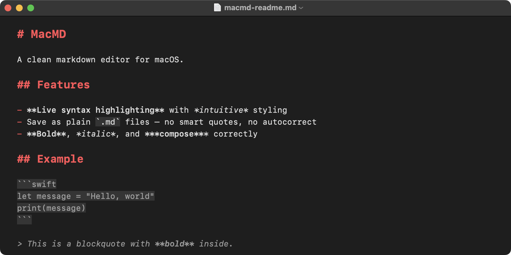

# MacMD

A simple, clean, secure markdown editor for macOS. Feels like TextEdit, but for `.md` files and with live syntax highlighting.

Built for editing claude.md, skill definitions, agent configs, READMEs, and similar small-to-medium markdown files.



## Install

Minimum macOS version: 14 (Sonoma). Tested on 15 (Sequoia) and 26 (Tahoe).

### 1. Download

Go to the [latest release](../../releases/latest). You'll see several files — grab just one:

| File | What it is | Who should click it |
|---|---|---|
| **`MacMD-1.0.0.dmg`** | The installer. ~160 KB. | **Most people — this is the one you want.** |
| `MacMD-1.0.0.zip` | Same app, zipped instead of in a DMG. | Alternative if your browser doesn't like DMGs. |
| `*.sha256` | Tiny checksum files. | Optional; for verifying your download wasn't tampered with. |
| `Source code (zip / tar.gz)` | The Swift source. | Only if you want to build it yourself. Ignore otherwise. |

### 2. Copy to Applications

Double-click the DMG. A Finder window opens with `MacMD.app` and an `Applications` shortcut. Drag `MacMD.app` onto `Applications`. You can eject the DMG after.

### 3. First launch (one-time Gatekeeper approval)

MacMD is signed ad-hoc, not Apple-notarized (notarization requires a paid Apple Developer account), so macOS blocks it the first time.

**On macOS 15 Sequoia or newer:**

1. Double-click `MacMD` in Applications.
2. macOS shows "cannot verify this app is free from malware." Click **Done**.
3. Open **System Settings → Privacy & Security**. Scroll to the **Security** section.
4. Next to "MacMD was blocked to protect your Mac", click **Open Anyway**.
5. Confirm once more, authenticate with Touch ID or password.
6. MacMD launches.

**On macOS 14 Sonoma:**

Right-click `MacMD.app` → **Open** → **Open** in the confirmation dialog.

After this one-time approval, MacMD launches normally every time.

### 4. Open .md files

Any of these work:

- Double-click any `.md` file and choose **Open With → MacMD** (or set it as default via File → Get Info → Open with → Change All).
- Drag a `.md` file onto the MacMD icon in the Dock.
- File → Open inside MacMD.
- Cmd-N for a new untitled document.

### Uninstall

Drag `MacMD.app` from Applications to Trash. No daemons, no receipts, no leftover prefs.

## Write and save

File menu works exactly as you'd expect. All commands use standard Mac keybindings.

    Cmd-N     New document
    Cmd-O     Open an existing .md file
    Cmd-S     Save (prompts for filename + location on first save)
    Cmd-Shift-S   Save As
    Cmd-W     Close window (prompts to save if dirty)
    Cmd-Z / Cmd-Shift-Z   Undo / Redo
    Cmd-F     Find (inline find bar)
    Cmd-,     Preferences (none yet — App does nothing on this shortcut)

The editor autosaves in the background. If the app quits unexpectedly, reopening recovers your work. Recent files appear under `File → Open Recent`.

## What gets highlighted

As you type, MacMD styles these markdown constructs live:

    # Heading 1 through ###### Heading 6   — bold, accent color, sized per level
    **bold** and __bold__                  — bold
    *italic* and _italic_                  — italic
    ***bold italic***                      — bold + italic compose correctly
    `inline code`                          — subtle background tint
    ```                                    — fenced code blocks get the same tint,
    fenced code                               and style to end of document if you
    ```                                       haven't closed them yet
    [link label](https://example.com)      — label underlined in link color, URL muted
    - unordered, * and + also valid        — marker in accent color
    1. ordered list                        — marker in accent color
    > blockquote                           — muted + italic, composes with bold inside
    ---                                    — muted

Highlighting updates only the paragraph you're editing, so typing stays smooth on long files. Inside fenced code blocks, inline rules are intentionally suppressed — code stays code.

Semantic colors are used throughout, so Dark Mode adapts automatically when you toggle system appearance.

## What gets saved

Plain UTF-8 text. Byte-for-byte what you typed — no smart quotes, no dash substitution, no link detection, no autocorrect. Paste from another app always comes in as plain text.

If you try to open a file that isn't valid UTF-8, MacMD refuses and surfaces a clear error rather than silently corrupting it with replacement characters.

## Security

MacMD is sandboxed. It has access only to:

    Files you explicitly open or save to (user-selected read/write).

It has no network access, no access to the camera, microphone, location, photos, contacts, calendars, or Spotlight indexing. It doesn't register any URL schemes or services. The hardened runtime is enabled.

You can verify at any time:

    codesign -dv --entitlements - /path/to/MacMD.app

## Build from source

Requires Xcode 16 or newer.

    xcodebuild -project MacMD.xcodeproj -scheme MacMD -configuration Release -destination 'platform=macOS' build

The built app lands in Xcode's DerivedData under `Build/Products/Release/MacMD.app`, or you can open the project in Xcode and press Cmd-R to run it directly.

Run tests:

    xcodebuild test -project MacMD.xcodeproj -scheme MacMD -destination 'platform=macOS'

There are 20 unit tests covering every syntax highlighting rule and the tricky edge cases (bold+italic composition, unclosed code fences, list-marker vs italic disambiguation, paragraph-style preservation).

### Produce a release bundle

    Scripts/package.sh 1.0.0

This runs a clean Release build and produces four artifacts in `dist/`:

    MacMD-1.0.0.zip           signature-preserving zip (built with ditto)
    MacMD-1.0.0.zip.sha256
    MacMD-1.0.0.dmg           drag-to-Applications installer
    MacMD-1.0.0.dmg.sha256

Upload all four to the GitHub release page. Most users prefer the DMG; the zip is a smaller alternative.

## Project layout

    MacMD/
      README.md                   This file
      LICENSE                     MIT
      CHANGELOG.md                Version history
      .gitignore
      MacMD.xcodeproj/            Xcode project
      MacMD/                      Source
        MacMDApp.swift            Entry point; @main; DocumentGroup
        MarkdownDocument.swift    FileDocument; UTF-8 read/write
        DocumentView.swift        Thin SwiftUI wrapper around the text view
        MarkdownTextView.swift    NSViewRepresentable wrapping NSTextView
        MarkdownHighlighter.swift NSTextStorageDelegate; regex rules
        Theme.swift               Fonts, colors, paragraph style
        Info.plist                Document types, UTI declarations
        MacMD.entitlements        Sandbox; user-selected files R/W
        Assets.xcassets/          AppIcon + AccentColor
      MacMDTests/
        MarkdownHighlighterTests.swift
      Scripts/
        README.md
        make_icon.swift           Regenerates the app icon PNGs
        package.sh                Builds Release and produces zip + dmg in dist/
      docs/
        screenshot.png
      dist/                       (gitignored) release artifacts go here

## Known intentional limits

No live rendered preview pane. No toolbar. No theming UI. No word count, export to HTML, or front-matter handling. The goal is "simple like TextEdit, but for markdown" — anything beyond that is out of scope.

No multi-cursor editing (NSTextView supports it; MacMD preserves only the primary selection through external text updates). No outline pane, no file browser.
