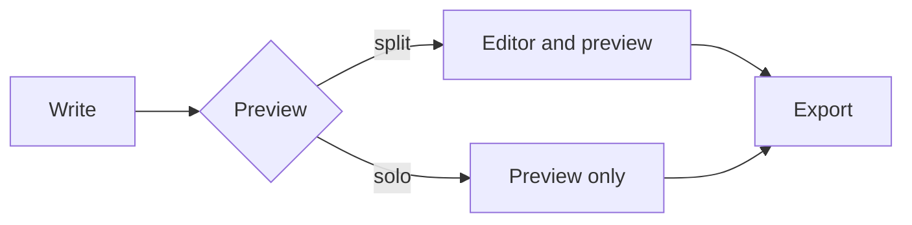
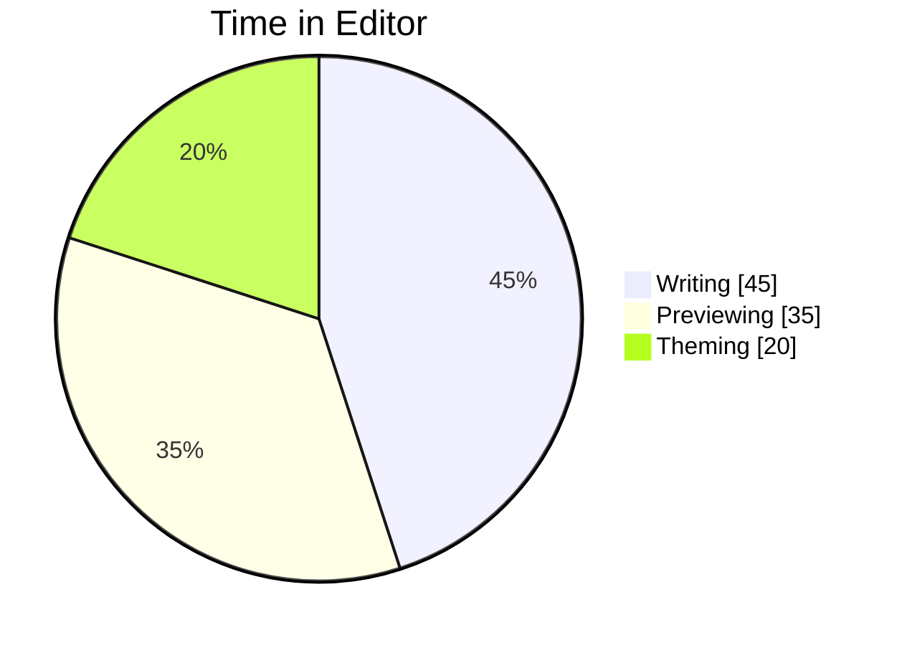
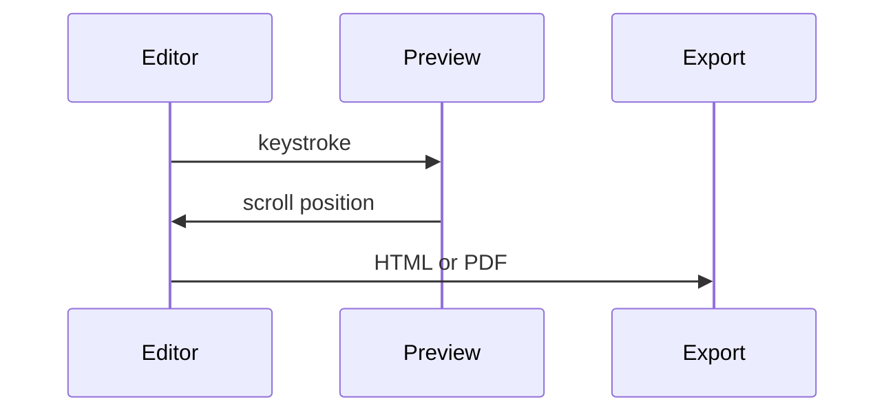

# MacMD Showcase
MacMD is a markdown file editor built for MacOS. It's fully featured for agentic use, and customizable for humans with taste. Check out some of MacMD's features below with a side-by-side comparison using the preview toggle.

## Text

Body text sits at the theme's body color. Inline `code` stays monospace in every font family, and you get **bold**, *italic*, ~~strikethrough~~, and [links](https://github.com/sleetcrash/MacMD).
> ***Blockquotes** can also be edited.*

## Lists & Tasks

### Lists

- Unordered marker inherits this section's heading color
- Second item
  - Nested item
- Third item

1. Ordered marker also inherits the section color
2. Second item
3. Third item

### Tasks

- [x] Themes own their backgrounds
- [x] Static and dynamic themes
- [ ] Release notes drafted

## Code

```swift
struct Theme {
    let scheme: Scheme
    let background: ColorPair
    let isStatic: Bool
}
```

## Tables

| Scheme   | Heading colors | Background |
| -------- | -------------- | ---------- |
| None     | inherits body  | theme      |
| Unified  | one color      | theme      |
| Standard | H1, H2, H3     | theme      |

## Diagrams

**Mermaid diagrams** follow the active theme: labels take the body color, boxes take the editor surface, and multi-color series cycle the theme's heading colors.







## Horizontal Rules & Setext Headings

### Horizontal Rule

A line of three dashes (---) draws a rule (horizontal line) when a blank line sits above it.

---

### Setext Headings

Three dashes (---) or equal signs (===) placed directly under the text will create setext headings:

H1 (===)
===
H2 (---)
---
